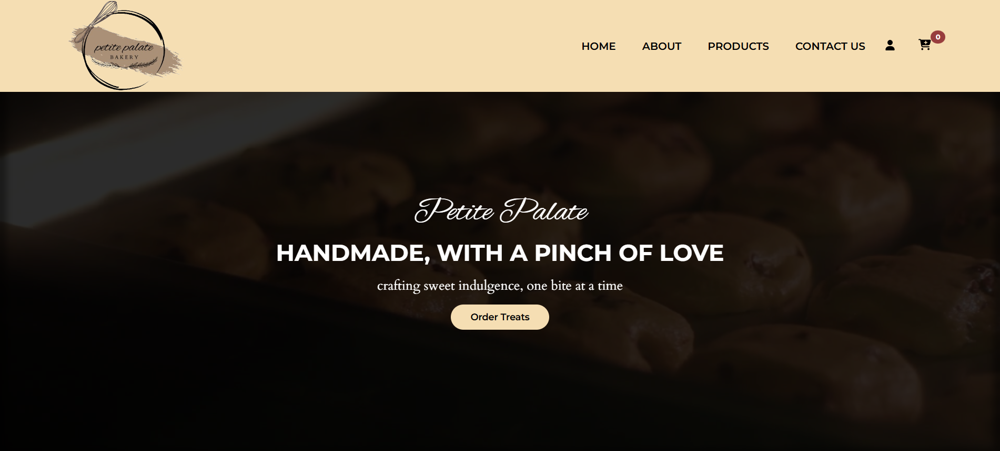
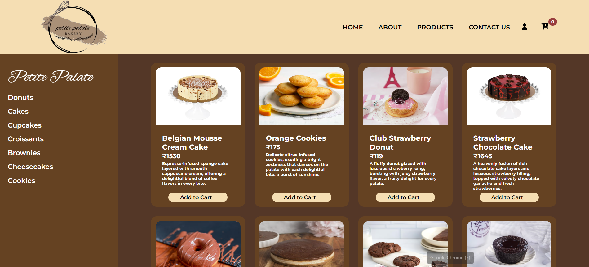
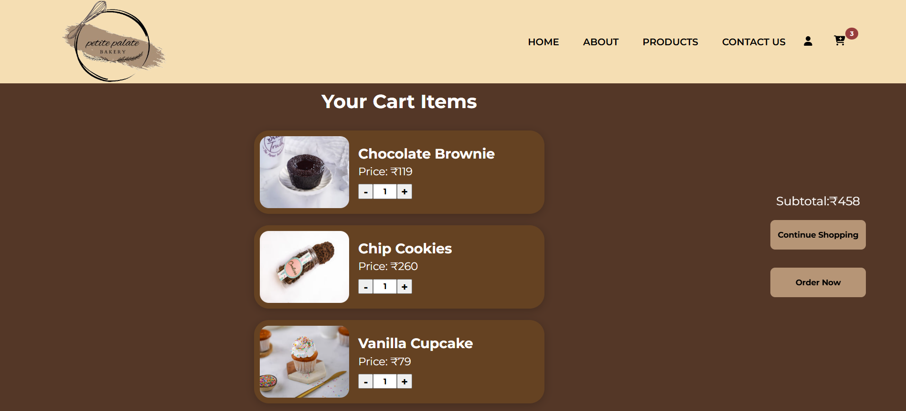

<h2 align="center">𝙿𝚎𝚝𝚒𝚝𝚎 𝙿𝚊𝚕𝚊𝚝𝚎 🍪</h2>

<p align="center">
  𝙰 𝚜𝚠𝚎𝚎𝚝 𝚊𝚗𝚍 𝚊𝚎𝚜𝚝𝚑𝚎𝚝𝚒𝚌 𝚘𝚗𝚕𝚒𝚗𝚎 𝚋𝚊𝚔𝚎𝚛𝚢 𝚎𝚡𝚙𝚎𝚛𝚒𝚎𝚗𝚌𝚎 — 𝚋𝚛𝚘𝚠𝚜𝚎, 𝚏𝚒𝚕𝚝𝚎𝚛, 𝚊𝚗𝚍 𝚜𝚑𝚘𝚙 𝚢𝚘𝚞𝚛 𝚏𝚊𝚟𝚘𝚛𝚒𝚝𝚎 𝚝𝚛𝚎𝚊𝚝𝚜 🍩🧁
</p>

---

<h3 align="left">🌐 𝙻𝚒𝚟𝚎 𝙳𝚎𝚖𝚘  -
  <a href="https://petitebakery.vercel.app" target="_blank">𝙲𝚑𝚎𝚌𝚔 𝚘𝚞𝚝 𝚝𝚑𝚎 𝚕𝚒𝚟𝚎 𝚠𝚎𝚋𝚜𝚒𝚝𝚎 𝚑𝚎𝚛𝚎!
  </a>
</h3>

---

<h3 align="left">🚀 𝚀𝚞𝚒𝚌𝚔 𝚂𝚝𝚊𝚛𝚝</h3>

<h4 align="left">𝙿𝚛𝚎𝚛𝚎𝚚𝚞𝚒𝚜𝚒𝚝𝚎𝚜</h4>
- 𝙽𝚘𝚍𝚎.𝚓𝚜 (𝚟14 𝚘𝚛 𝚑𝚒𝚐𝚑𝚎𝚛)
- 𝚗𝚙𝚖 𝚘𝚛 𝚢𝚊𝚛𝚗 𝚙𝚊𝚌𝚔𝚊𝚐𝚎 𝚖𝚊𝚗𝚊𝚐𝚎𝚛

<h4 align="left">𝙸𝚗𝚜𝚝𝚊𝚕𝚕</h4>

```bash
# 𝙲𝚕𝚘𝚗𝚎 𝚝𝚑𝚎 𝚛𝚎𝚙𝚘𝚜𝚒𝚝𝚘𝚛𝚢
git clone https://github.com/your-username/petitebakery.git

# 𝙽𝚊𝚟𝚒𝚐𝚊𝚝𝚎 𝚝𝚘 𝚙𝚛𝚘𝚓𝚎𝚌𝚝 𝚍𝚒𝚛𝚎𝚌𝚝𝚘𝚛𝚢
cd petitebakery

# 𝙸𝚗𝚜𝚝𝚊𝚕𝚕 𝚍𝚎𝚙𝚎𝚗𝚍𝚎𝚗𝚌𝚒𝚎𝚜
npm install

# 𝚂𝚝𝚊𝚛𝚝 𝚍𝚎𝚟𝚎𝚕𝚘𝚙𝚖𝚎𝚗𝚝 𝚜𝚎𝚛𝚟𝚎𝚛
npm start
```

𝚃𝚑𝚎 𝚊𝚙𝚙𝚕𝚒𝚌𝚊𝚝𝚒𝚘𝚗 𝚠𝚒𝚕𝚕 𝚋𝚎 𝚊𝚟𝚊𝚒𝚕𝚊𝚋𝚕𝚎 𝚊𝚝 http://localhost:3000

---

<h3 align="left">🗺️ 𝙿𝚛𝚘𝚓𝚎𝚌𝚝 𝚂𝚝𝚛𝚞𝚌𝚝𝚞𝚛𝚎</h3>

```
petitebakery/
├── public/          # 𝚂𝚝𝚊𝚝𝚒𝚌 𝚊𝚜𝚜𝚎𝚝𝚜
│ ├── images/        # 𝙿𝚛𝚘𝚍𝚞𝚌𝚝 𝚒𝚖𝚊𝚐𝚎𝚜
│ ├── index.html     # 𝙼𝚊𝚒𝚗 𝙷𝚃𝙼𝙻 𝚏𝚒𝚕𝚎
│ └── manifest.json  # 𝙿𝚆𝙰 𝚖𝚊𝚗𝚒𝚏𝚎𝚜𝚝
├── src/             # 𝚂𝚘𝚞𝚛𝚌𝚎 𝚌𝚘𝚍𝚎
│ ├── components/    # 𝚁𝚎𝚞𝚜𝚊𝚋𝚕𝚎 𝚄𝙸 𝚌𝚘𝚖𝚙𝚘𝚗𝚎𝚗𝚝𝚜
│ ├── assets/        # 𝙲𝚘𝚖𝚙𝚘𝚗𝚎𝚗𝚝 𝚊𝚜𝚜𝚎𝚝𝚜
│ ├── App.js         # 𝙼𝚊𝚒𝚗 𝚊𝚙𝚙 𝚌𝚘𝚖𝚙𝚘𝚗𝚎𝚗𝚝
│ ├── index.js       # 𝙰𝚙𝚙 𝚎𝚗𝚝𝚛𝚢 𝚙𝚘𝚒𝚗𝚝
│ └── ...            # 𝙾𝚝𝚑𝚎𝚛 𝚁𝚎𝚊𝚌𝚝 𝚌𝚘𝚖𝚙𝚘𝚗𝚎𝚗𝚝𝚜
├── README.md        # 𝙿𝚛𝚘𝚓𝚎𝚌𝚝 𝚍𝚘𝚌𝚞𝚖𝚎𝚗𝚝𝚊𝚝𝚒𝚘𝚗
└── package.json     # 𝙳𝚎𝚙𝚎𝚗𝚍𝚎𝚗𝚌𝚒𝚎𝚜 𝚊𝚗𝚍 𝚜𝚌𝚛𝚒𝚙𝚝𝚜
```
---

<h3 align="left">✨ 𝙵𝚎𝚊𝚝𝚞𝚛𝚎𝚜</h3>

- 🍰 𝙱𝚛𝚘𝚠𝚜𝚎 𝚝𝚑𝚛𝚘𝚞𝚐𝚑 𝚊 𝚠𝚒𝚍𝚎 𝚌𝚘𝚕𝚕𝚎𝚌𝚝𝚒𝚘𝚗 𝚘𝚏 **𝚌𝚊𝚔𝚎𝚜, 𝚌𝚞𝚙𝚌𝚊𝚔𝚎𝚜, 𝚍𝚘𝚗𝚞𝚝𝚜, 𝚌𝚘𝚘𝚔𝚒𝚎𝚜** & 𝚖𝚘𝚛𝚎  
- 🛍️ **𝙰𝚍𝚍 𝚝𝚘 𝙲𝚊𝚛𝚝** 𝚊𝚗𝚍 𝚖𝚊𝚗𝚊𝚐𝚎 𝚢𝚘𝚞𝚛 𝚜𝚎𝚕𝚎𝚌𝚝𝚒𝚘𝚗𝚜  
- ➖ 𝙸𝚗𝚌𝚛𝚎𝚊𝚜𝚎/𝙳𝚎𝚌𝚛𝚎𝚊𝚜𝚎 𝚒𝚝𝚎𝚖 𝚚𝚞𝚊𝚗𝚝𝚒𝚝𝚢 & 𝚛𝚎𝚖𝚘𝚟𝚎 𝚒𝚝𝚎𝚖𝚜 𝚏𝚛𝚘𝚖 𝚌𝚊𝚛𝚝  
- 💸 𝙰𝚞𝚝𝚘-𝚞𝚙𝚍𝚊𝚝𝚎𝚍 **𝚌𝚊𝚛𝚝 𝚝𝚘𝚝𝚊𝚕**  
- 🎨 𝙰𝚎𝚜𝚝𝚑𝚎𝚝𝚒𝚌 𝚊𝚗𝚍 𝚖𝚘𝚍𝚎𝚛𝚗 **𝚄𝙸 𝚍𝚎𝚜𝚒𝚐𝚗**  
- 🔍 **𝙵𝚒𝚕𝚝𝚎𝚛 𝚙𝚛𝚘𝚍𝚞𝚌𝚝𝚜 𝚋𝚢 𝚌𝚊𝚝𝚎𝚐𝚘𝚛𝚢**  

---

<h3 align="left">🛠️ 𝚃𝚎𝚌𝚑 𝚂𝚝𝚊𝚌𝚔</h3>
<p>
  
  
  
  
  
</p>

---

<h3 align="left">📸 𝚄𝙸 𝙿𝚛𝚎𝚟𝚒𝚎𝚠 / 𝚂𝚌𝚛𝚎𝚎𝚗𝚜𝚑𝚘𝚝𝚜</h3>

<p align="center">🏠 𝙷𝚘𝚖𝚎𝚙𝚊𝚐𝚎</p>
<p align="center">
  
</p>

<p align="center">🛍️ 𝙿𝚛𝚘𝚍𝚞𝚌𝚝𝚜 𝙿𝚊𝚐𝚎</p>
<p align="center">
  
</p>

<p align="center">🛒 𝙲𝚊𝚛𝚝 𝙿𝚊𝚐𝚎</p>
<p align="center">
  
</p>

---

<h3 align="left">🚀 𝙵𝚞𝚝𝚞𝚛𝚎 𝙴𝚗𝚑𝚊𝚗𝚌𝚎𝚖𝚎𝚗𝚝𝚜</h3>

- 🔑 **𝚄𝚜𝚎𝚛 𝙰𝚞𝚝𝚑𝚎𝚗𝚝𝚒𝚌𝚊𝚝𝚒𝚘𝚗** 
- 🗄️ **𝙳𝚊𝚝𝚊𝚋𝚊𝚜𝚎 𝙸𝚗𝚝𝚎𝚐𝚛𝚊𝚝𝚒𝚘𝚗** 
- 💳 **𝙿𝚊𝚢𝚖𝚎𝚗𝚝 𝙶𝚊𝚝𝚎𝚠𝚊𝚢** 
- 📦 **𝙵𝚞𝚕𝚕-𝚂𝚝𝚊𝚌𝚔 𝙲𝚘𝚗𝚟𝚎𝚛𝚜𝚒𝚘𝚗** 

---
<h4 align="center">𝙼𝚊𝚍𝚎 𝚠𝚒𝚝𝚑 𝚕𝚘𝚟𝚎 𝚏𝚘𝚛 𝚊𝚕𝚕 𝚍𝚎𝚜𝚜𝚎𝚛𝚝 𝚕𝚘𝚟𝚎𝚛𝚜 🩷</h4>
